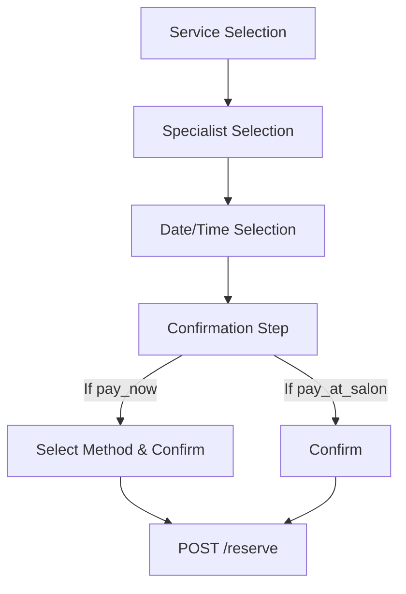

# Booking & Payment Orchestration Architecture

## Core Philosophy

The architecture is built on a strict separation of concerns:
**"The backend decides the rules; the frontend renders the experience."**

The frontend is completely decoupled from the internal logic of "how" or "why" a booking is permissible. It simply queries the context, renders the appropriate UI for the customer, and then commands the backend to execute the booking.

## The 3 Pillars of Booking

The frontend relies on exactly three endpoints to complete a booking journey.

### 1. Availability (Read)
`GET /api/v1/booking-context/availability`
*(Also accessible via `/portal/availability` for authenticated customers)*

- **Responsibility:** Returns the available dates and time slots for a specific service, salon, and optionally, a specialist.
- **Engine:** `AvailabilityEngine`

### 2. Payment Rules (Read)
`GET /api/v1/booking-context/payment`
*(Also accessible via `/portal/booking-context/payment`)*

- **Responsibility:** Determines if a payment is required *before* booking confirmation.
- **Engine:** `PaymentRulesEngine` & `EligiblePaymentMethodResolver`
- **Output:** Returns a `PaymentInstruction` DTO.

The `PaymentInstruction` is the single source of truth for the frontend.
- `customer_action`: `pay_now` or `pay_at_salon`
- `amountDueNow`: The exact amount to collect if `pay_now`.
- `eligibleMethods`: A list of methods capable of fulfilling the request (e.g., MTN Mobile Money, Visa).
- **Note:** Methods are resolved based on capabilities (e.g., `supports_online_payment`), not hardcoded rules.

### 3. Orchestration (Write)
`POST /api/v1/booking-orchestrator/reserve`
*(Also accessible via `/portal/bookings`)*

- **Responsibility:** The single point of command to create a reservation.
- **Engine:** `BookingOrchestrator`
- **Behavior:** This endpoint executes the transaction, locking slots and applying final business logic (like verifying payment idempotency). It results in either a `Reserved` or `Confirmed` status.

## Frontend UI Flow

The frontend owns the wizard navigation entirely using React state. There is no `generate-flow` endpoint driving the steps.

### The Confirmation Step
The final view is the `ConfirmationStep`. It dynamically adapts based on the `PaymentInstruction`.
- If `pay_at_salon`: It shows the summary and a "Confirm Booking" button.
- If `pay_now`: It appends the payment method selector directly to the summary and disables the "Confirm Booking" button until a method is chosen.

**Important:** Slots are **not** locked when the user views the payment options. The reservation command is only dispatched when they explicitly click "Confirm Booking".

## 3-Level Policy Inheritance

The `PaymentRulesEngine` resolves payment requirements using a 3-level hierarchy:

1. **Provider Level (Default):** The overarching tenant policy.
2. **Salon Level (Override):** Specific rules for a physical location.
3. **Service Level (Specific):** Service-specific rules (e.g., "Bridal Package requires 50% deposit").

The engine traverses from bottom to top to find the most specific rule applicable to the booking context.
